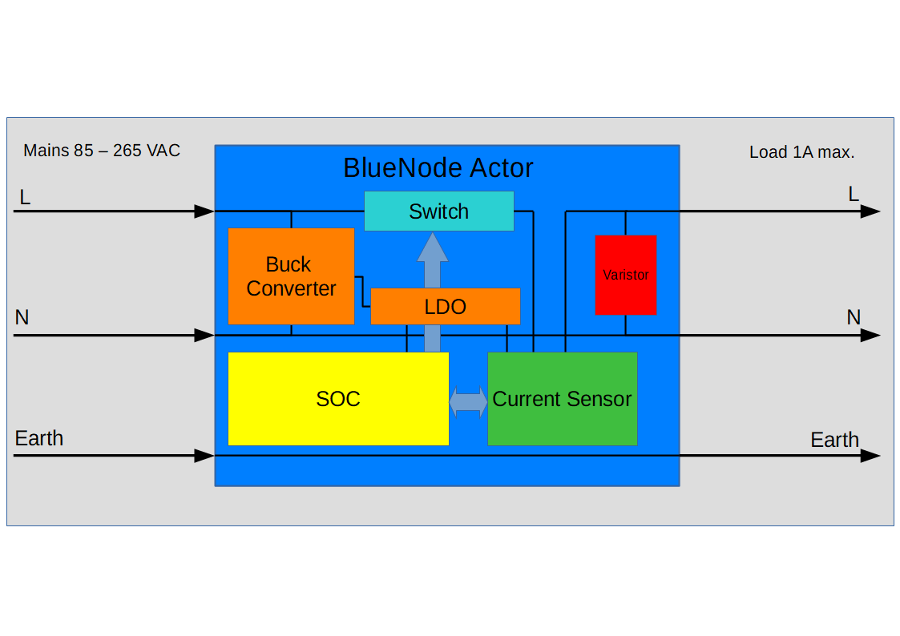
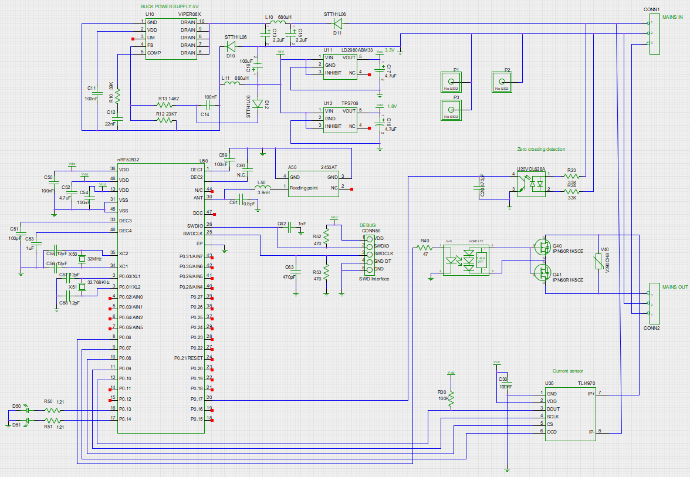
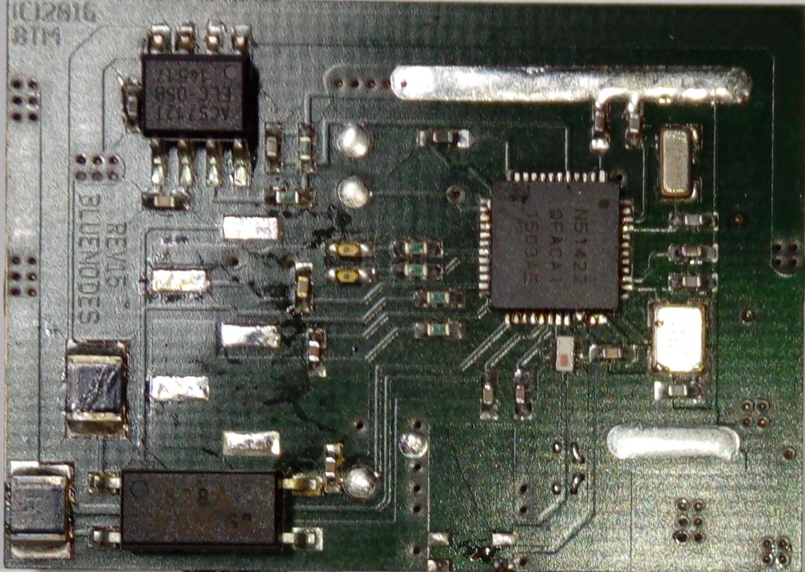

== Features

*Simplicity*
BlueNodes are easy to install at any place in the electrical circuit of a facility. They work with every AC mains voltage from 85V up to 265V. No extra power supply is needed for the devices.

*Extensibility*
installations can easily be extended starting with a single node because new nodes integrate seamlessly into the network without programming an address. 

*Independence*
any Android driven device with Bluetooth® 4.0 capabilities can hook into the network and control loads or gain live data over power consumptions. No special hardware is required. 

*Maintainability and Sustainability*
when firmware updates become available OTA-DFU (Over the Air Device Firmware Update) transports new firmware from the Android device to all nodes.

*Security*
Nodes can detect short-circuit situations or overload and cut mains before any fuse can break. An in-built temperature sensor avoids overheating. 

*Convenience*
Android devices with a running BlueNodes Controller application, automatically log into the mesh-network as they come into range. 

== Software
=== Firmware
uses BLE protocol stack, rebroadcasting mesh network technology using the IETF RFC6206 Trickle algorithm. Each node has a unique address and embedds automatically into an existing network. Different channels and access addresses can be configured to separate networks. Electrical current is measured by the sensor and converted continuously by the A/D converter.

=== Android Software
the Java based Android software automatically connects to the closest BlueNode. Once connected, all nodes are reachable. The facility can be structured in buildings - floors - rooms - lamps or other loads. New nodes can be inserted and given a name and icon. Structural data is stored in the Android devices' Sqlite database. The power management displays accumulated consumption statistics in kWh per Minute of an hour - hour of a day - day of a month - etc. The values are permanently stored in the devices' flash memory and can be reset anytime.

== Hardware
*PCB*
assembled double side on a 4 layer PCB 37.5 x 27 mm using SMD 0402 parts.

*SOC*
NRF51x22 based on ARM® Cortex M0 32 bit processor 16 MHz clock Bluetooth® 4.0 low energy 2.4 GHz RF.

*RF*
Johanson Technology 2.4 GHz SMD ceramic antenna with impedance matched balun and band pass filter.

*Current Sensor*
Infineon TLI4970-D025T5 miniature coreless magnetic current sensor for AC and DC measurements with digital interface and fast overcurrent detection.

*Load Switch*
dual Infineon MOSFET 600V CoolMOS™ CE Power Transistor with trailing-edge phase cut control.

*Power Supply*
VIPer™06 30 kHz PWM non-isolated buck converter circuit with 1.8V and 5V LDO output. Maximum   power consumption 30mA during continuous RF communication.

*Indicators*
2 LED indicating connection and health status.

*Interface*
5 pin connector pad with Vdd, GND, GND detect, SWDIO and SWDCLK

Block diagram

Schematics

SOC side

